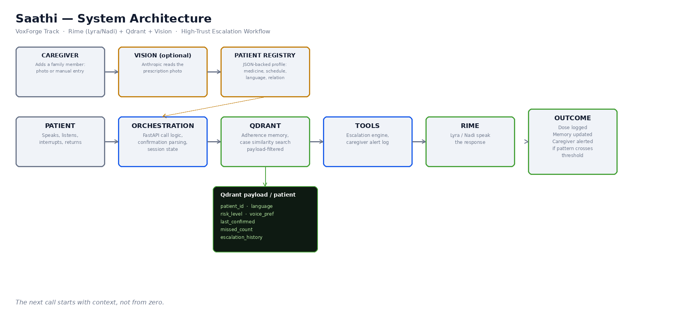
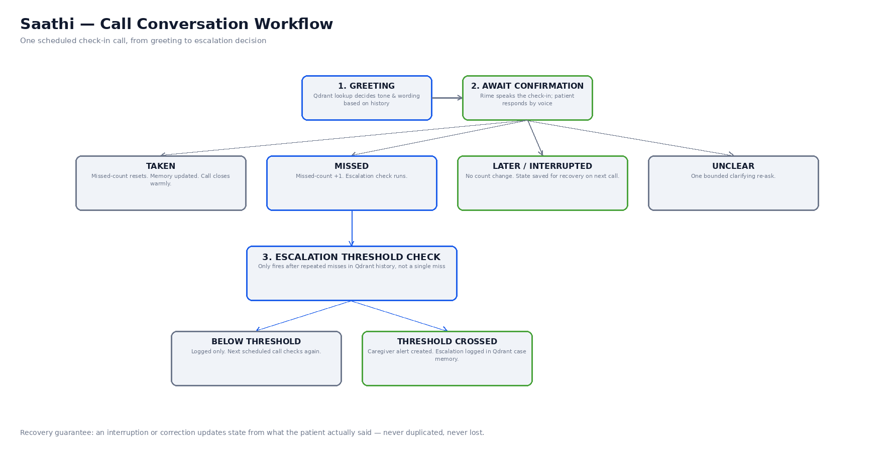
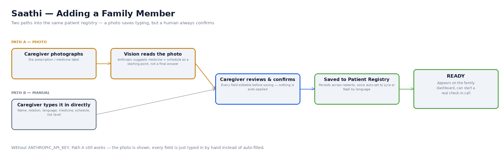

# Architecture — Saathi

This document is the deeper technical companion to the README's
architecture section, for the GitHub submission requirement
"Architecture / Evaluation Flow."

## System diagram

## Call workflow / state machine

## Onboarding flow (adding a family member)

## Components

### 1. Frontend (`frontend/`)
Plain HTML/CSS/JS call simulator, served directly by FastAPI. No build
step. Captures the patient's spoken reply via the browser's
`SpeechRecognition` API when available, with an always-visible typed
text fallback so the flow can be tested and judged in any environment.

### 2. Orchestrator (`backend/orchestrator.py`)
The call state machine. Owns:
- **Greeting generation** — reads Qdrant memory first, so the wording
  changes depending on history (routine reminder vs. "last time you
  hadn't taken it yet" vs. "calling back as promised").
- **Intent classification** (`classify_intent`) — rule-based keyword
  matching across four intents: `TAKEN`, `MISSED`, `LATER`, `UNCLEAR`.
- **Escalation logic** — a caregiver alert is only created once
  `missed_count` reaches `ESCALATION_THRESHOLD` (default 2)
  *consecutive* misses. A single miss is logged, not escalated.
- **Recovery** — a `LATER`/interrupted response sets `deferred=True`
  and does **not** touch `missed_count`. The next call reads that flag
  and greets accordingly, instead of repeating the same reminder or
  silently losing the fact that the patient asked for a callback.
- **Bounded re-asks** — an `UNCLEAR` response gets a limited number of
  clarifying re-asks (`MAX_CLARIFYING_REASKS`) before the call closes
  gracefully, so the system never loops forever on noisy input.

### 3. Qdrant store (`backend/qdrant_store.py`)
Two real, functional jobs — not decoration:

**a) Patient memory (payload).** One point per patient
(`patient_id` → deterministic UUID), holding the full `PatientMemory`
payload. Reads go through either a direct point lookup
(`get_patient_memory`) or an explicit `patient_id` payload filter
(`isolated_query`) — the latter is what the isolation test asserts
against, proving one patient's data structurally cannot leak into
another's call.

Payload fields:

| Field | Role |
|---|---|
| `patient_id` | Isolation — every read/write is scoped to this |
| `language`, `voice_pref` | Routing — selects the Rime voice/language |
| `risk_level` | Routing + tone — shifts escalation threshold framing |
| `missed_count`, `last_confirmed`, `last_missed` | Memory — drives the escalation check |
| `deferred` | Recovery — remembers a "call later" across calls |
| `escalation_history` | Case memory — prevents duplicate alerts, gives a caregiver an audit trail |
| `call_log` | Transparency — what was heard on each turn |

**b) Case similarity search (vectors).** Each call event is embedded
with a small deterministic hashed bag-of-words function
(`embed_text` — see its docstring for why this placeholder was chosen
over a real embedding API) and stored as the point's vector. A real
Qdrant nearest-neighbour search (`find_similar_cases`) then surfaces
anonymised "similar cases" — e.g., other patients with a comparable
risk trajectory — which a caregiver dashboard could use for context.

### 4. Rime client (`backend/rime_client.py`)
Thin wrapper around Rime's documented TTS endpoint
(`POST https://users.rime.ai/v1/rime-tts`, Bearer auth,
`Accept: audio/wav`). If `RIME_API_KEY` is unset or the call fails for
any reason, `synthesize()` returns `None` rather than raising — the
orchestrator and frontend both handle this by falling back to a
clearly-labelled offline text/browser-voice path, so the app is always
runnable without a paid key, while the real demo must use a real key.
Accepts an optional `lang` short code (e.g. `"hin"` for Hindi, from
`backend/i18n.py`), included in the request payload only when given.

### 5. i18n (`backend/i18n.py`)
All spoken-turn text lives here as Devanagari-script Hindi and English
templates (`TEXT`), plus the language-code mappings Rime and the
browser's speech APIs each expect. `orchestrator.py` never hardcodes
English strings — every greeting/reply goes through `t(language, key,
**kwargs)`. Devanagari (not transliterated Hindi) is used because
that's what a Hindi TTS voice is trained on, and it's also what
Chrome's `hi-IN` `SpeechRecognition` returns for the patient's spoken
replies — so `classify_intent` in `orchestrator.py` matches keyword
sets in both English and Devanagari script. This module also owns the
`PERSONA_NAME` mapping ("Lyra" / "नादी (Nadi)") shown in the UI.

### 6. Patient registry (`backend/patient_registry.py`)
A small JSON-file-backed store layered on top of the immutable demo
patients in `seed_patients.py`. A caregiver's "Add family member" or
"Fix dose time" actions go through here — `add()` and `update()` —
and persist across restarts (`backend/data/patients_store.json`,
gitignored). The orchestrator reads patients through this registry,
not the static seed list directly, so a caregiver-added patient can
actually receive real check-in calls.

### 7. Vision client (`backend/vision_client.py`)
Reads a photographed prescription via Anthropic's vision-capable
Messages API and extracts a medicine name + schedule as strict JSON.
Same graceful-fallback pattern as Rime: without `ANTHROPIC_API_KEY`,
`extract()` returns `configured=False` and the frontend just leaves
the fields for the caregiver to fill in by hand — the photo upload
flow is never blocked by a missing key. Extraction is always shown to
the caregiver for review before saving; nothing is auto-applied.

## Sequence walkthrough (happy path)

1. `POST /api/call/start {patient_id}`
2. Orchestrator reads `PatientMemory` from Qdrant (or creates a fresh one).
3. Greeting text is built from that memory; Rime synthesizes it.
4. Qdrant is queried for similar cases; response returned to the frontend, which plays the audio and renders the memory + similar-cases panels.
5. Patient replies (voice or text) → `POST /api/call/respond`.
6. `classify_intent` determines TAKEN / MISSED / LATER / UNCLEAR.
7. Memory is updated and written back to Qdrant; if the escalation threshold is crossed, an alert is created and logged.
8. Rime synthesizes the reply; frontend updates memory panel, similar cases, and (if applicable) shows the escalation banner and refreshes the alerts feed.

## Data flow for isolation & recovery (why the tests matter)

- **Isolation:** `tests/test_orchestrator.py::test_patient_memory_isolation` drives a miss for one patient and asserts a second patient's memory and an explicit payload-filtered query are both untouched, and that reusing a session_id against the wrong patient_id raises an error.
- **Recovery:** `test_later_defers_without_incrementing_missed_count` proves a deferred call doesn't count as a miss and that the next call's greeting reflects the deferral — the concrete mechanism behind the "never starts from zero" claim.

See `README.md` §7 for what this architecture does **not** yet prove.
